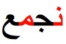

# 现代标准阿拉伯语

本文简单整理了阿拉伯字母及其在现代标准阿拉伯语中使用的基本信息，并就如何使用Unicode书写阿拉伯语提供建议。本文不包括古兰经的用法。

## 本文所涵盖的语言

**现代标准阿拉伯语**是北非和西亚国家在书面和大多数正式演讲中使用的阿拉伯语变体。阿拉伯语的其他变体在排版上可能会有所不同。

## 基本原则

阿拉伯字母的一些特征对字体设计师来说是具有挑战性的。

### 纵向连接

字母除了由右至左连接，还可以纵向（自上而下）连接，不过并非所有字体都支持。

<figure id="fig_vertical_joining">
<table>
<tbody>
<tr>
<td style="text-align: center;"></td>

<td style="text-align: center;"></td>
</tr>
</tbody>
</table>
<figcaption>几乎是纵向的的连接（左）和水平的连接（右）</figcaption>
</figure>

需要注意的是，这不仅具有审美上的意义，而且还会影响文字两端对齐时的宽度。在手写文本中，作者可自行决定选择适合指定行长的连接方式。

### “牙齿”字母

当连续字母的中部形式一致时，它们就可以呈现出类似牙齿的形状。

<figure id="fig_teeth_letters">

<figcaption>“牙齿”字母</figcaption>
</figure>

## 伊斯兰手稿传统

### 起源

## 词汇表

| **英语**                | **简体中文** |
|-------------------------|--------------|
| baseline                | 基线         |
| bleed                   | 出血         |
| code point              | 码位         |
| contextual form         | 内文形式     |
| Eastern Arabic numerals | 阿拉伯文数字 |
| European numerals       | 阿拉伯数字   |
| final form              | 尾部形式     |
| font                    | 字体         |
| horizontal writing mode | 横排         |
| initial form            | 首部形式     |
| isolated form           | 独立形式     |
| medial form             | 中部形式     |
| vertical writing mode   | 直排         |

## 参考文献

Richard Ishida. Arabic & Persian Layout Requirements. 12 December 2023. W3C Note. URL: https://www.w3.org/TR/alreq/