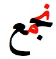
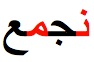
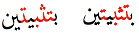

# 波斯语

本文简单整理了阿拉伯字母及其在波斯语中使用的基本信息，并就如何使用Unicode书写波斯语提供建议。

## 本文所涵盖的语言

**波斯语**是伊朗和阿富汗的官方语言。伊朗波斯语也称为西波斯语，阿富汗波斯语也称为东波斯语，当地称为达里语。

**塔吉克语**是塔吉克斯坦使用的波斯语，用西里尔字母书写，因此不在本文档的描述范围内。

## 基本原则

阿拉伯字母的一些特征对字体设计师来说是具有挑战性的。

### 纵向连接

字母除了由右至左连接，还可以纵向（自上而下）连接，不过并非所有字体都支持。

<figure id="fig_vertical_joining">
<table>
<tbody>
<tr>
<td style="text-align: center;"></td>

<td style="text-align: center;"></td>
</tr>
</tbody>
</table>
<figcaption>几乎是纵向的的连接（左）和水平的连接（右）</figcaption>
</figure>

需要注意的是，这不仅具有审美上的意义，而且还会影响文字两端对齐时的宽度。在手写文本中，作者可自行决定选择适合指定行长的连接方式。

### “牙齿”字母

当连续字母的中部形式一致时，它们就可以呈现出类似牙齿的形状。

<figure id="fig_teeth_letters">

<figcaption>“牙齿”字母</figcaption>
</figure>

## 伊斯兰手稿传统

### 起源

阿拉伯字母属于闪语族书写系统，由纳巴泰字母演变而来，在公元4世纪产生，与叙利亚字母和希伯来字母关系密切。

伊斯兰教认为，先知穆罕默德是用阿拉伯语接受启示的，因此阿拉伯语被赋予了宗教含义。穆罕默德于公元632年去世后，在阿布·伯克尔和奥斯曼两位哈里发的带领下，他的启示首次以书面形式进行了汇编和标准化，由此产生的经典《古兰经》成为了信仰的核心载体。因此，阿拉伯字母随着伊斯兰文明的传播而超越了其起源地，并开始用于书写其他语言。由于伊斯兰教的广泛传播，过去和现在都有许多不同的语言使用阿拉伯字母书写，因此出现了不同的正字法。

### 常用字体风格

伊斯兰手稿是随着伊斯兰艺术和文明的发展而演变的。早在公元7世纪，在岩石圆顶的马赛克中就可以找到装饰性的阿拉伯字母。除了在建筑中频繁出现之外，书法也成为伊斯兰最重要的艺术形式之一。通过抄写书籍和书法艺术，手稿逐渐成为伊斯兰文明的核心要素。

随着时间的推移，字体风格也在不断演变，很多字体已不再被使用，也有一些保留了下来。

TBD

## 字符

### 字符编码

## 词汇表

| **英语**                | **简体中文** |
|-------------------------|--------------|
| baseline                | 基线         |
| bleed                   | 出血         |
| code point              | 码位         |
| contextual form         | 内文形式     |
| Eastern Arabic numerals | 阿拉伯文数字 |
| European numerals       | 阿拉伯数字   |
| final form              | 尾部形式     |
| font                    | 字体         |
| horizontal writing mode | 横排         |
| initial form            | 首部形式     |
| isolated form           | 独立形式     |
| medial form             | 中部形式     |
| vertical writing mode   | 直排         |

## 参考文献

Richard Ishida. Arabic & Persian Layout Requirements. 12 December 2023. W3C Note. URL: https://www.w3.org/TR/alreq/