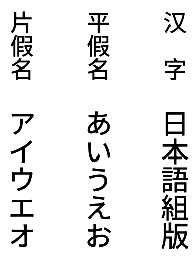
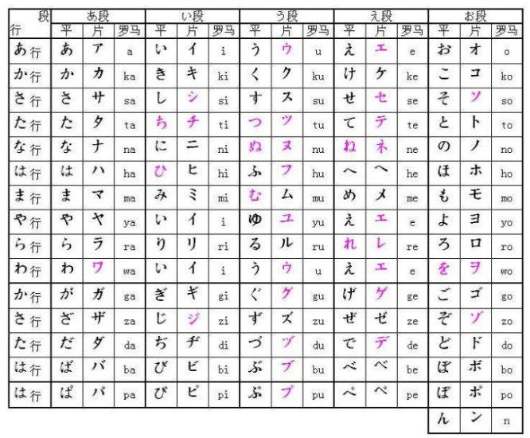

# 日语

本文简单整理了日语书写系统于排版上的需求。本文的主要讨论对象是图书，但许多需求也适用于其他出版物。

本文参考了JIS X 4051标准和W3C《日文排版需求》文档。

## 使用的文字和基本原则

日文的书写方向有直排及横排两种。

日文排版主要使用的文字为汉字、平假名和片假名。

原则上，日文排版所使用的汉字、平假名和片假名比例皆为1:1的正方形，无缝隙并列排成版面。

## 汉字、平假名和片假名

现代日文由几种文字构成：起源于中国的表意文字——**汉字**，音节文字——**平假名**（主要用在接头词、形容词与动词的活用语尾，以及没有汉字的日文词）和**片假名**（主要用于外来语）以及以拉丁字母书写的罗马字。

《大汉和辞典》共记载超过四万个汉字，不过现代日语中常用汉字大约只有两千余个。

除了第一行的元音和假名n以外，其他的假名都是辅音和元音的搭配。

清音假名的右上角可以添加一个长得像引号的**浊音符**，表示浊音化，还可以添加一个小圆圈，称为**半浊音符**，表示[p]的音。

促音是在日语中用来表示辅音延长的符号，写法为っ、片假名ッ。促音“っ”是“つ”的缩小版本，但2个假名的关系只是外型相似，在发音上完全没有关系。

拗音是将“き（ki）、ぎ（gi）、し（shi）、ち（chi）、じ/ぢ（ji）、に（ni）、ひ（hi）、び（bi）、ぴ（pi）、み（mi）、り（ri）”和“や行”连在一起读。这时“や行”的假名会缩小，像促音“っ”一样。

长音符是在日语中用来表示拉长元音的符号。通常写作“ー”，直排时为“丨”，书写时主要用在片假名之后。

汉字、平假名和片假名大小相同，有着正方形的文字外框。文字外框的正中央，有着比文字外框小的字面（反过来说，字面的上下左右与文字外框之间有若干空白。根据不同的字面设计，空白的大小会有所不同）。

<a class="termref" href="#term.character-size">文字尺寸</a>指的是文字外框的尺寸。

除了**全角**的汉字和假名之外，Unicode中还有一个**半角**片假名区块，不过这些码位产生于计算机的早期，通常不推荐使用。

全角拉丁字母也很常见。Unicode中有一个全角拉丁字母和标点的区块，不过一般推荐使用字体来切换全角和半角。

## 汉字和假名的配置原则

原则上，汉字、平假名和片假名的<a class="termref" href="#term.character-frame">文字外框</a>彼此紧贴配置，称作<a class="termref" href="#term.solid-setting">密排</a>。

<!-- ## 日语排版的页面设计 -->

## 文字书写方向

### 日文的书写方向

日文的文字书写方向分为<a class="termref" href="#term.vertical-writing-mode">直排</a>与<a class="termref" href="#term.horizontal-writing-mode">横排</a>。

> [!NOTE]
> 政府文件和教育资源大多采用横排。大部分主流报纸完全采用直排，面向普通读者的大部分杂志也采用直排。此外，阅读量最大的图书——小说也大多采用直排（有些读者说，如果小说不采用直排，他们就无法阅读）。因此，可以预计直排对日语的重要性暂时不会改变。

### 横排与直排的主要差异点

直排与横排的主要差异点，列举如下：

#### 直排

文字由上向下，行由右向左排列。栏水平切割，上下分栏。

页面由左页（正面）开始，由右向左进行配置（由左向右翻页）。

#### 横排

文字由左向右，行由上向下排列。栏垂直切割，左右分栏。

页面由右页（正面）开始，由左而右进行配置（由右向左翻页）。

#### 文中包含西文字母、阿拉伯数字时

直排时，西文字母或阿拉伯数字有以下三种配置方式：

1. 与日文采相同的书写方向，依字母逐个排列，主要用于单一西文字母或阿拉伯数字，以及首字母缩略词等。

> [!NOTE]
> 西文字母或阿拉伯数字，采用此配置时，需使用与汉字相同尺寸、字幅固定的等宽字体，而非比例字体。

2. 文字以顺时针方向旋转90°，主要用于西文的单词、语句等。

3. 保持正常方向，横排处理。主要应用于两位数字（见JIS X 4051的4.8节）。

横排时，以正常方向配置。

## 行内文字排版处理

### 标点符号与其排版

## 词汇表

<table>
<thead>
<tr>
<th>英语</th>
<th>日语</th>
<th>简体中文</th>
<th>定义</th>
</tr>
</thead>

<tbody>
<tr id="term.base-character">
<td>base character</td>
<td lang="ja">親文字</td>
<td>基文</td>
<td> </td>
</tr>
<tr id="term.bleed">
<td>bleed</td>
<td lang="ja">裁切り</td>
<td>出血</td>
<td> </td>
</tr>
<tr id="term.character-advance">
<td>character advance</td>
<td lang="ja">字幅</td>
<td>字幅</td>
<td> </td>
</tr>
<tr id="term.character-frame">
<td>character frame</td>
<td lang="ja">外枠</td>
<td>文字外框</td>
<td> </td>
</tr>
<tr id="term.character-size">
<td>character size</td>
<td lang="ja">文字サイズ</td>
<td>文字尺寸</td>
<td> </td>
</tr>
<tr id="term.column">
<td>column</td>
<td lang="ja">段</td>
<td>栏</td>
<td> </td>
</tr>
<tr id="term.column-gap">
<td>column gap</td>
<td lang="ja">段間</td>
<td>栏间距</td>
<td> </td>
</tr>
<tr id="term.emphasis-dots">
<td>emphasis dots</td>
<td lang="ja">圏点</td>
<td>着重号</td>
<td> </td>
</tr>
<tr id="term.european-numerals">
<td>European numerals</td>
<td lang="ja">アラビア数字</td>
<td>阿拉伯数字</td>
<td> </td>
</tr>
<tr id="term.font">
<td>font</td>
<td lang="ja">フォント</td>
<td>字体</td>
<td> </td>
</tr>
<tr id="term.full-width">
<td>full-width</td>
<td lang="ja">全角</td>
<td>全角</td>
<td> </td>
</tr>
<tr id="term.group-ruby">
<td>group-ruby</td>
<td lang="ja">グループルビ</td>
<td> </td>
<td> </td>
</tr>
<tr id="term.half-width">
<td>half-width</td>
<td lang="ja">半角</td>
<td>半角</td>
<td> </td>
</tr>
<tr id="term.horizontal-writing-mode">
<td>horizontal writing mode</td>
<td lang="ja">横組</td>
<td>横排</td>
<td>行内每字按水平方向由左至右，页内每行从上至下、每栏由左至右的排列方法，或者按此方法的排列状态。</td>
</tr>
<tr id="term.hyphenation">
<td>hyphenation</td>
<td lang="ja">ハイフネーション</td>
<td> </td>
<td> </td>
</tr>
<tr id="term.illustrations">
<td>illustrations</td>
<td lang="ja">図版</td>
<td>图片</td>
<td> </td>
</tr>
<tr id="term.japanese-and-western-mixed-text-composition">
<td>Japanese and Western mixed text composition</td>
<td lang="ja">和欧文混植</td>
<td>日、西文混排</td>
<td> </td>
</tr>
<tr id="term.jouyou-kanji-table">
<td>Jouyou Kanji Table</td>
<td lang="ja">常用漢字表</td>
<td>常用汉字表</td>
<td> </td>
</tr>
<tr id="term.line-adjustment">
<td>line adjustment</td>
<td lang="ja">行の調整処理</td>
<td>行内调整</td>
<td> </td>
</tr>
<tr id="term.mincho-typeface">
<td>Mincho typeface</td>
<td lang="ja">明朝体</td>
<td>宋体</td>
<td> </td>
</tr>
<tr id="term.number-of-columns">
<td>number of columns</td>
<td lang="ja">段数</td>
<td>栏数</td>
<td> </td>
</tr>
<tr id="term.page-format">
<td>page format</td>
<td lang="ja">組体裁</td>
<td>排版样式</td>
<td>书籍等出版物上图、文及其他元素的版式布局及表现形式。</td>
</tr>
<tr id="term.printing-types">
<td>printing types</td>
<td lang="ja">活字</td>
<td>活字</td>
<td></td>
</tr>
<tr id="term.solid-setting">
<td>solid setting</td>
<td lang="ja">ベタ組</td>
<td>密排</td>
<td>将文字依其外框紧密排列的排版方式。</td>
</tr>
<tr id="term.vertical-writing-mode">
<td>vertical writing mode</td>
<td lang="ja">縦組</td>
<td>直排/竖排</td>
<td>行内每字按垂直方向由上至下，页内每行从右至左、每栏由上至下的排列方法，或者按此方法的排列状态。</td>
</tr>

</tbody>
</table>

## 参考文献

* Hiroyuki Chiba; et al. Requirements for Japanese Text Layout 日本語組版処理の要件. 11 August 2020. NOTE. URL: https://www.w3.org/TR/jlreq/
* JIS X 4051：2004（日本語文書の組版方法，Formatting rules for Japanese documents），日本規格協会，東京，2004年
* Bobby Tung; Yijun Chen; Eric Q LIU; Hui Jing Chen; Zhengyu Qian; Fuqiao Xue; Richard Ishida. Requirements for Chinese Text Layout - 中文排版需求. 1 November 2023. W3C Note. URL: https://www.w3.org/TR/clreq/